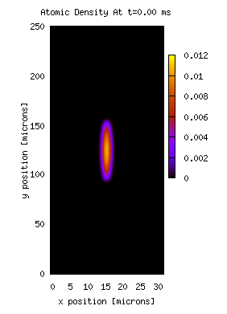
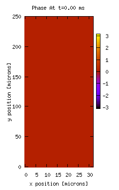

# Bose-Einstein Condensate splitting experiments    

 

See for example:    
[https://doi.org/10.1103/PhysRevLett.99.240406](https://doi.org/10.1103/PhysRevLett.99.240406)    

Used as basis of publications on quantum information of multi-mode AMO systems:    
[https://doi.org/10.1103/PhysRevLett.105.240404](https://doi.org/10.1103/PhysRevLett.105.240404)    

GitHub repo:   
[https://github.com/dougfaust/2_mode_BEC](https://github.com/dougfaust/2_mode_BEC)    

## Index of Code Files
* ``Makefile``
* ``main.c``
* ``nrutil.h``
    utilities from Numerical Recipes and group legacy code
* ``nutil.c``
    nutil implementation file
* ``odeintM.c`` / ``odeintW.c``
    master routine to propagate a single timestep  
    suffix "M" optimized for Fock space coefficients  
    suffix "W" optimized for wavefunction  
* ``rkqs_.c`` / ``rkck_.c``
    Runge-Kutta-Cash-Karp adapted for complex functions   
    "M" and "W" suffixes replacing the underscores defined as above   
* ``realft.c`` / ``four1.c`` / ``sinft.c``
    FFT routines (replaced by FFTW and MPI in 2D and 3D code)
  
## Data Files
* ``InputCI.dat`` / ``InputWF.dat``
    Provides initial values of the Fock space (CI) coefficients and wave function (WF) - 
    typically found by a complex-time relaxation solver to find the ground state
 
